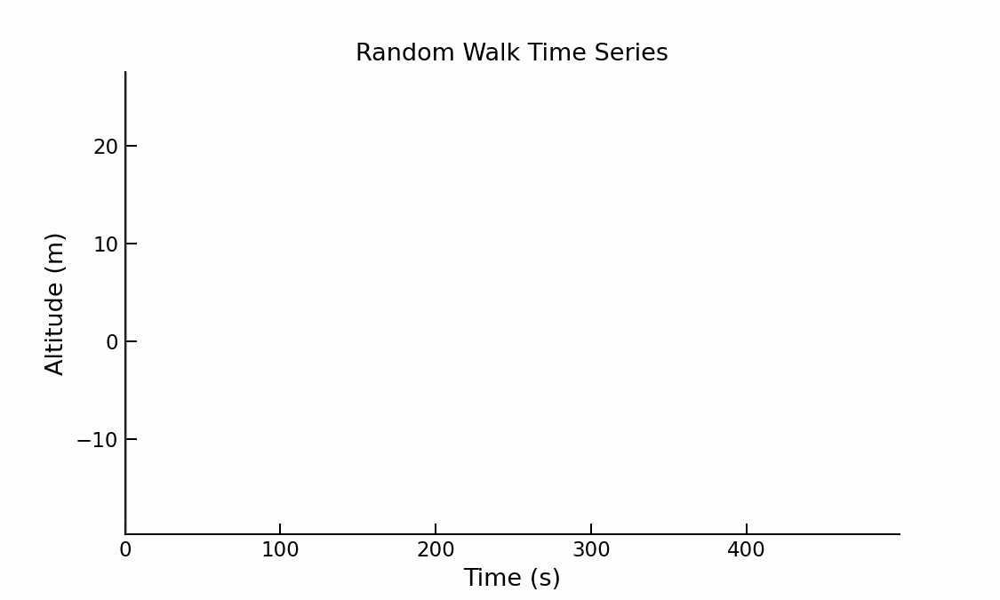
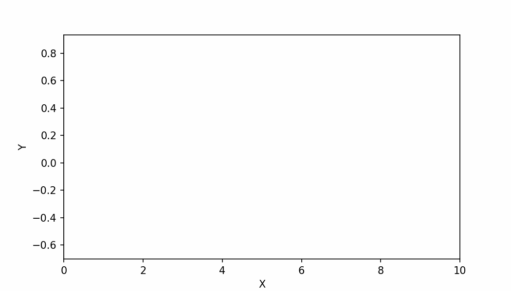

# Animate Any Line Plot

A lightweight Python tool for creating animated GIFs that visualize the
**evolution of a time series** by progressively revealing a line plot
from left to right along the x-axis.

This approach provides a clear and intuitive way to show how data
develops over time using a single, continuous animation.

---

## Example Outputs

### Random Walk


---

## Features

- Works with **y-only** or **(x, y)** time series
- Left-to-right line reveal animation
- Optional sliding time cursor
- Fixed axis limits for stable visualization
- High-quality, looping GIF output
- Compatible with Spyder, Jupyter, and terminal workflows

---

## Installation

Clone the repository and install the required dependencies:

```bash
git clone https://github.com/akaawase-bernard/timeseries2gif.git
cd timeseries2gif

```
---

### Damped Oscillation

